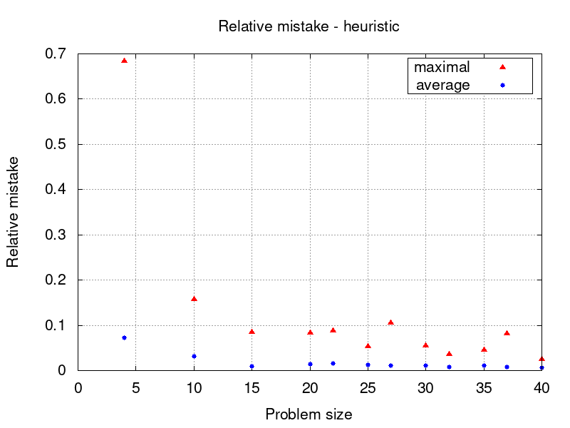
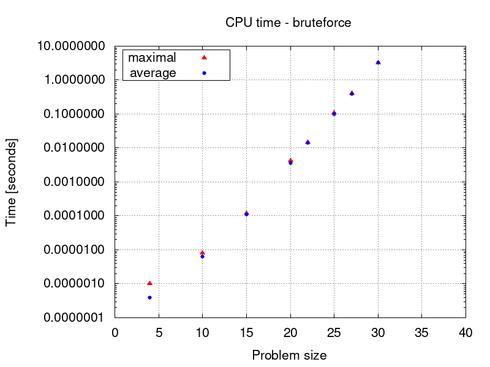
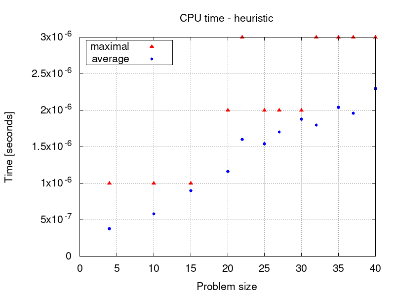

# MI-PAA - Knapsack problem
*Simon Let \<letsimon@fit.cvut.cz\>*

## Problem specification
The knapsack problem or rucksack problem is a problem in combinatorial optimization: Given a set of items, each with a weight and a value, determine the number of each item to include in a collection so that the total weight is less than or equal to a given limit and the total value is as large as possible.[1]  

Exact definition and instructions: https://edux.fit.cvut.cz/courses/MI-PAA/homeworks/01/start

## Possible solutions (Incomplete list)
- Bruteforce
- Simple heuristic
- Branch & bound
- Dynamic programming
- Fully polynomial time approximation scheme

## Solution overview
I have implemented **bruteforce solution** and **heuristic solution that uses price per weight as heuristic criteria**.

### Bruteforce
Brute-force search, is a very general problem-solving technique that consists of systematically enumerating all possible candidates for the solution and checking whether each candidate satisfies the problem's statement.[2]

### Heuristic 
Heuristic approach, is any approach to problem solving, learning, or discovery that employs a practical method not guaranteed to be optimal or perfect, but sufficient for the immediate goals. Where finding an optimal solution is impossible or impractical, heuristic methods can be used to speed up the process of finding a satisfactory solution.[3]

I'm using **price per weight** as criteria for heuristic.

## Algorithm description

### Bruteforce
Imagine space of all possible solutions as a graph where nodes are solutions and there is an edge between solutions that only differ in one bit (one item is missing or one extra item is present).  
I'm using Hamiltonian path[4] to iterate trough all solutions in such a way that only one item is either added or removed from knapsack in each step.  
I'm incrementing a counter in each step and I'm using bitwise representation of this counter to calculate next item to add or remove.  

### Price-per-weight heuristic 
First I sort the items by their price per weight.  
In each step I add item with the higest price:weight ratio.
I stop when the next item can't be added because of insufficient capacity.

## Performance measurements 

## Conclusion

### Bruteforce
Bruteforce runs in **O(2^N )** as we can clearly see in the plot.

There are 2^N possible solutions that algorithm has to evaluate.  
There is a constant amount of operations that is performed for each solution.  
Item that should be added or removed next is calculated in O\*(1).

### Heuristic
Graph for Heuristic kind of looks like O(N) but it is actually **O(N\*logN)**.

First we sort all the items in O(N\*logN).
Then we try to add all the items in O(N).

## Source code
https://gitlab.fit.cvut.cz/letsimon/fit-ctu-mi-ppa/tree/master/0_knap

## References

[1]: https://en.wikipedia.org/wiki/Knapsack_problem  
\[1\]: https://en.wikipedia.org/wiki/Knapsack_problem

[2]: https://en.wikipedia.org/wiki/Brute-force_search
\[2\]: https://en.wikipedia.org/wiki/Brute-force_search

[3]: https://en.wikipedia.org/wiki/Heuristic
\[3\]: https://en.wikipedia.org/wiki/Heuristic

[4]: https://en.wikipedia.org/wiki/Hamiltonian_path
\[4\]: https://en.wikipedia.org/wiki/Hamiltonian_path

