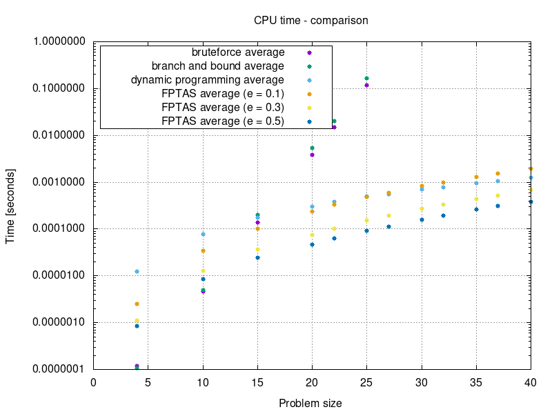
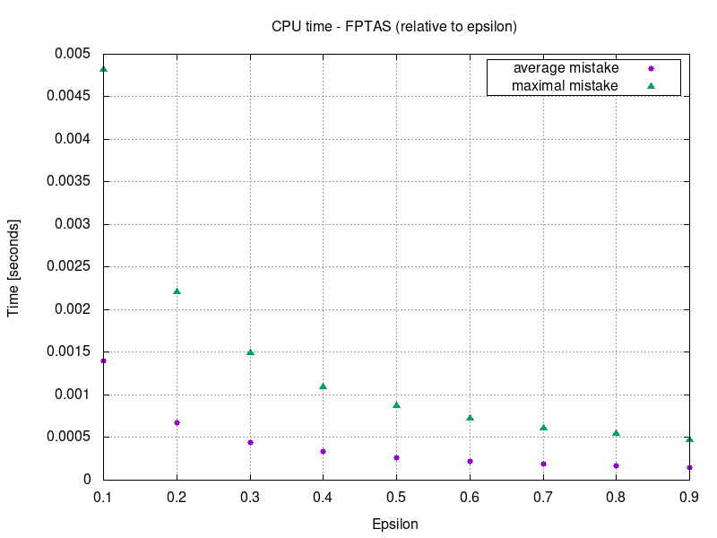
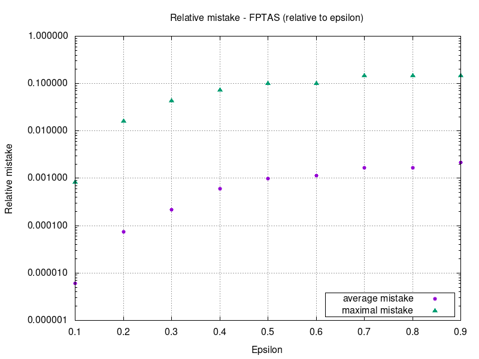

# MI-PAA - Knapsack problem
*Simon Let \<letsimon@fit.cvut.cz\>*

## Problem specification
The knapsack problem or rucksack problem is a problem in combinatorial optimization: Given a set of items, each with a weight and a value, determine the number of each item to include in a collection so that the total weight is less than or equal to a given limit and the total value is as large as possible.[1]  

Exact definition and instructions: https://edux.fit.cvut.cz/courses/MI-PAA/homeworks/01/start

## Possible solutions
- Bruteforce
- Heuristic solution
- Branch & bound
- Dynamic programming
- Fully polynomial time approximation scheme (FPTAS)

## Solution overview
I have implemented **bruteforce solution**, **heuristic solution** that uses price per weight as heuristic criteria, **branch & bound solution**, **dynamic programming solution** (decomposition by price) and a solution using **FPTAS**.

### Bruteforce
Brute-force search, is a very general problem-solving technique that consists of systematically enumerating all possible candidates for the solution and checking whether each candidate satisfies the problem's statement.[2]

### Heuristic 
Heuristic approach, is any approach to problem solving, learning, or discovery that employs a practical method not guaranteed to be optimal or perfect, but sufficient for the immediate goals. Where finding an optimal solution is impossible or impractical, heuristic methods can be used to speed up the process of finding a satisfactory solution.[3]

I'm using **price per weight** as criteria for heuristic method.

### Branch & bound
A branch-and-bound algorithm explores a rooted tree that represents the state space of all possible solutions. Before enumerating the candidate solutions of a branch, the branch is checked against upper and lower estimated bounds on the optimal solution, and is discarded if it cannot produce a better solution than the best one found so far by the algorithm.[5]

### Dynamic programming 
Dynamic programming is a method for solving a complex problem by breaking it down into a collection of simpler subproblems, solving each of those subproblems just once, and storing their solutions. A dynamic programming algorithm will examine the previously solved subproblems and will combine their solutions to give the best solution for the given problem.[6]

### FPTAS
A FPTAS is an algorithm which takes an instance of an optimization problem and a parameter `ε > 0` and, in polynomial time, produces a solution that is within a factor `1 + ε` of being optimal (or `1 - ε` for maximization problems). Any FPTAS algorithm is polynomial in both the problem size `N` and `1/ε`.[7]

## Algorithm description

### Bruteforce
Imagine the state space of all possible solutions as a graph where nodes are solutions and there is an edge between solutions that only differ in one bit (one item is missing or one extra item is present).  
I'm using Hamiltonian path[4] to iterate trough all solutions in such a way that only one item is either added or removed from knapsack in each step.  
I'm incrementing a counter in each step and I'm using bitwise representation of this counter to calculate next item to add or remove.  

### Branch & bound
Imagine the state space of all possible solutions as a binary tree where each leaf represents one solution an each inner node represents set of solutions. 

First I sort the items by their price.
Then I precompute the maxumum price gain that can be achieved in each level of the tree (state space).
I use **recursion** to explore the state space.
I prune the branches that can't contain optimal solution. (one of following is true):
- Current weigth is greater than knapsack capacity.
- Current price plus maximum price gain is less than price of already discovered solution.

### Price-per-weight heuristic 
First I sort the items by their price per weight.  
In each step I add item with the higest price:weight ratio.
I stop when the next item can't be added because of insufficient capacity.

### Dynamic programming (decomposition by price) 
First I sort the items by their price.
Then I create a table where each cell represents an optimal solution to a subproblem and contains a weigth of the solution (or INF if solution does not exist).
Each cell in `Xth` row represents solutions with price equal to `X`.
Each cell in `Xth` column represents solutions that only considers first `X` items from original problem.
To get optimal solution for each cell we use solutions to subproblems from previous column.
Optimal solution for each cell either **adds item from coresponding column** or **uses previous solution for the same price** whichever gives lesser total weigth.

### FPTAS
I divide the prices of all items by `ε * P / N` where `ε` is parameter, `P` is the price of the most expensive item and `N` is number of items.
This reduces the size of the table and complexity of the solution.
Then I continue the same way as I would with the dynamic programming solution.
Finally I calcualte the exact price of the solution using original prices and approximate solution.

## Performance measurements 

*Measured using Intel Pentium B950*

## Conclusion

### Bruteforce
Bruteforce runs in **O(2^N )** as we can see in the plot.

The algorithm has to evaluate 2^N possible solutions.  
There is a constant amount of operations that is performed for each solution.  
Item that should be added or removed next is calculated in O\*(1).

### Branch & bound
TODO

### Heuristic
Graph for Heuristic kind of looks like O(N) but it is actually **O(N\*logN)**.

First we sort all the items in O(N\*logN).  
Then we keep adding items until we run out of capacity - O(N).

### Dynamic programming solution
TODO

### FPTAS
TODO

## Source code
https://gitlab.fit.cvut.cz/letsimon/fit-ctu-mi-ppa/tree/2.0/knapsack-problem

## References

[1]: https://en.wikipedia.org/wiki/Knapsack_problem  
\[1\]: https://en.wikipedia.org/wiki/Knapsack_problem

[2]: https://en.wikipedia.org/wiki/Brute-force_search
\[2\]: https://en.wikipedia.org/wiki/Brute-force_search

[3]: https://en.wikipedia.org/wiki/Heuristic
\[3\]: https://en.wikipedia.org/wiki/Heuristic

[4]: https://en.wikipedia.org/wiki/Hamiltonian_path
\[4\]: https://en.wikipedia.org/wiki/Hamiltonian_path

[5]: https://en.wikipedia.org/wiki/Branch_and_bound
\[5\]: https://en.wikipedia.org/wiki/Branch_and_bound

[6]: https://en.wikipedia.org/wiki/Dynamic_programming
\[6\]: https://en.wikipedia.org/wiki/Dynamic_programming

[7]: https://en.wikipedia.org/wiki/Polynomial-time_approximation_scheme
\[7\]: https://en.wikipedia.org/wiki/Polynomial-time_approximation_scheme

