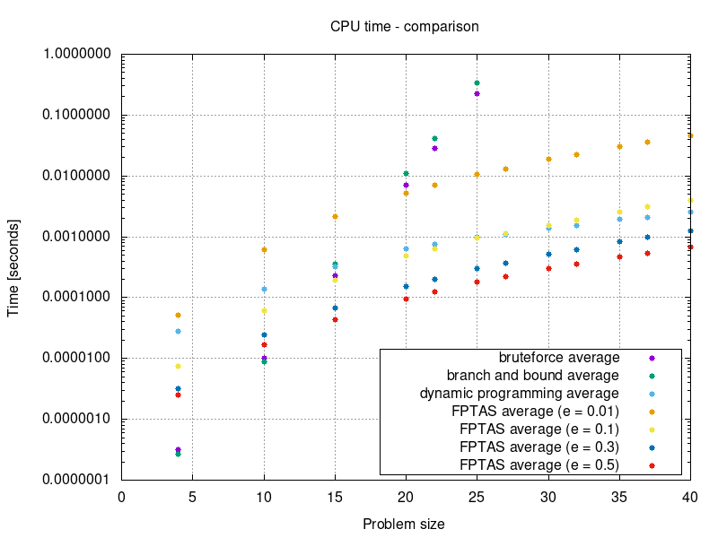
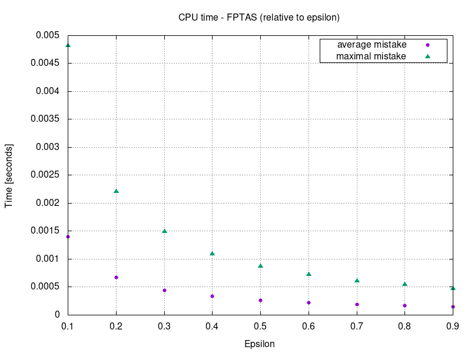
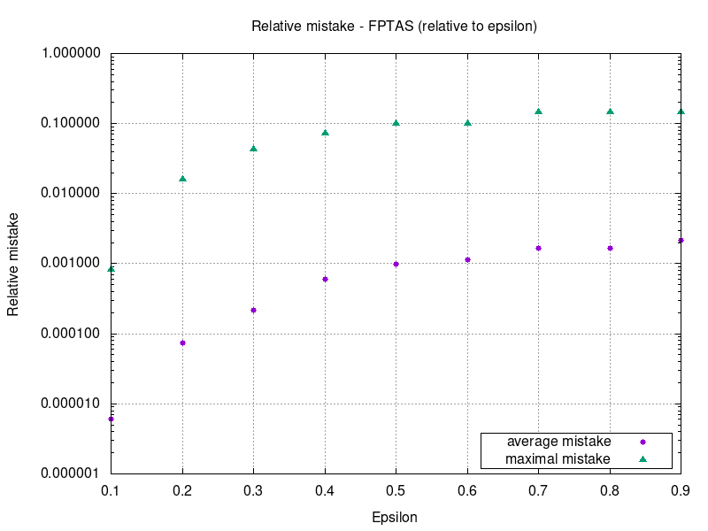

# MI-PAA - Knapsack problem
*Simon Let \<letsimon@fit.cvut.cz\>*

## Problem specification
The knapsack problem or rucksack problem is a problem in combinatorial optimization: Given a set of items, each with a weight and a value, determine the number of each item to include in a collection so that the total weight is less than or equal to a given limit and the total value is as large as possible.[1]  

Exact definition and instructions: https://edux.fit.cvut.cz/courses/MI-PAA/homeworks/01/start

## Possible solutions
- Bruteforce
- Heuristic solution
- Branch & bound
- Dynamic programming
- Fully polynomial time approximation scheme (FPTAS)

## Solution overview
I have implemented **bruteforce** solution, **heuristic** solution that uses price per weight as heuristic criteria, **branch & bound** solution, **dynamic programming** solution (decomposition by price) and a solution using **FPTAS**.

### Bruteforce
Brute-force search, is a very general problem-solving technique that consists of systematically enumerating all possible candidates for the solution and checking whether each candidate satisfies the problem's statement.[2]

### Heuristic 
Heuristic approach, is any approach to problem solving, learning, or discovery that employs a practical method not guaranteed to be optimal or perfect, but sufficient for the immediate goals. Where finding an optimal solution is impossible or impractical, heuristic methods can be used to speed up the process of finding a satisfactory solution.[3]

I'm using **price per weight** as criteria for heuristic method.

### Branch & bound
A branch-and-bound algorithm explores a rooted tree that represents the state space of all possible solutions.

Before enumerating the candidate solutions of a branch, the branch is checked against upper and lower estimated bounds on the optimal solution, and is discarded if it cannot produce a better solution than the best one found so far by the algorithm.[5]

### Dynamic programming 
Dynamic programming is a method for solving a complex problem by breaking it down into a collection of simpler sub problems, solving each of those sub problems just once, and storing their solutions.  
A dynamic programming algorithm will examine the previously solved sub problems and will combine their solutions to give the best solution for the given problem.[6]

I'm **decomposing** the knapsack problem into a sub problems **by price**.

 
 

### FPTAS
A FPTAS is an algorithm which takes an instance of an optimization problem and a parameter `ε > 0` and, in polynomial time, produces a solution that is within a factor `1 + ε` of being optimal (or `1 - ε` for maximization problems).
Any FPTAS algorithm is polynomial in both the problem size `N` and `1/ε`.[7]

My FPTAS solution is actually just dynamic programming solution (using decomposition by price) where the total number of sub problems is reduced.

## Algorithm description

### Bruteforce
Imagine the state space of all possible solutions as a graph where nodes are solutions and there is an edge between solutions that only differ in one bit (one item is missing or one extra item is present).  
I'm using Hamiltonian path[4] to iterate trough all solutions in such a way that only one item is either added or removed from knapsack in each step.  
I'm incrementing a counter in each step and I'm using bit-wise representation of this counter to calculate next item to add or remove.  

### Branch & bound
Imagine the state space of all possible solutions as a binary tree where each leaf represents one solution and each inner node represents a set of solutions. 

First I sort the items by their price.  
Then I precompute the maximal price gain that can be achieved in each level of the tree (state space).   
I use **recursion** to explore the state space.   
I prune the branches that cannot contain optimal solution - one of following is true:
- Current weight is greater than knapsack capacity.
- Current price plus maximal price gain is less than price of already discovered solution.

### Price-per-weight heuristic 
First I sort the items by their price per weight.    
In each step I add item with the highest price:weight ratio. 
I stop when the next item can't be added because of insufficient capacity.

### Dynamic programming (decomposition by price) 
First I sort the items by their price.  
Then I create a table where each cell represents an optimal solution to a sub problem.  
Each cell contains a weight of the optimal solution for given sub problem (or INF if solution does not exist).  
`Xth` row represents solutions with price equal to `X`.  
`Xth` column represents solutions that only considers first `X` items from original problem.  
To get optimal solution for each cell we use solutions to sub problems from previous column.  
Optimal solution for each cell either **adds item corresponding to the column** or **uses previous solution with the same price** whichever gives lesser total weight.   
Final solution is the one with highest price with weight lower than capacity.

### FPTAS
I divide the prices of all items by `(ε * P) / N` where `ε` is parameter, `P` is the price of the most expensive item and `N` is number of items.   
This reduces the size of the table and the complexity of the solution.   
Then I continue the same way as I would with the **dynamic programming** solution.   
Finally I calculate the exact price of the solution using original prices and approximate solution retrieved from the table.

 
 
 

## Performance measurements 

*Measured using Intel Pentium B950*

## Conclusion

### Bruteforce
Bruteforce runs in **O(2^N )** as we can see in the plot.

The algorithm has to evaluate 2^N possible solutions.  
There is a constant amount of operations that is performed for each solution.  
Item that should be added or removed next is calculated in O\*(1).

### Branch & bound
Branch & bound runs in **O(2^N )** as we can see in the plot.

The algorithm has to traverse the (complete) binary tree with 2^(N+1)-1 nodes in the worst case scenario.  
There is a constant amount of operations that is performed for each node.  

We can see that the algorithm slower than bruteforce solution which *makes sense* because:
- We are using recursion which gives us more overhead than iterative solution.
- **Bruteforce** has to try **2^N** different solutions whereas **branch & bound** has **2^(N+1)-1** nodes to explore.    
It seems that we would have to prune more than half of the nodes to match the performance of the iterative bruteforce.  

*NOTE: I have also measured times for recursive bruteforce to confirm that my branch & bound is not broken and I have confirmed that branch & bound gives me improvement over recursive bruteforce. (not included in the plots)*

### Heuristic
Heuristic runs in **O(N\*logN)**.

First we sort all the items in O(N\*logN).  
Then we keep adding items until we run out of capacity - O(N).

 
 
 

### Dynamic programming solution
Dynamic programming solution runs in O(N\*S + N\*logN) which is almost always subset of **O(N\*S)** (if `logN < S`).  
`S` is sum of prices.   

First we sort all the items in O(N\*logN).  
Then we calculate the sum of all prices (`S`) in O(N).

After that we need to solve table of all `N * S` sub problems.  
And there is a constant amount of operation that is performed for each cell of the table.

### FPTAS
#### Complexity
FPTAS solution runs in **O(N^2\*S/(ε\*P))**.  
`S` is sum of prices.   
`K = (ε*P)/N`    
`P` is the price of the most expensive item.   

First we divide the price of each item by `K`.  
Then we continue the same way as we would with the **dynamic programming** solution but with reduced prices and therefore reduced complexity.
Exact price is retrieved from the table in N steps.

Higher the `ε` lower the complexity.  
For small `ε` FPTAS is slower than dynamic programming solution because we are dividing all prices by number `< 1` which actually increases the size of table and therefore the complexity.  

#### Relative mistake 
Relative mistake of any FPTAS solution is never higher than `ε`.  
Relative mistake is directly proportional to `ε`.

## Source code
https://gitlab.fit.cvut.cz/letsimon/fit-ctu-mi-ppa/tree/2.0/knapsack-problem

## References

[1]: https://en.wikipedia.org/wiki/Knapsack_problem  
\[1\]: https://en.wikipedia.org/wiki/Knapsack_problem

[2]: https://en.wikipedia.org/wiki/Brute-force_search
\[2\]: https://en.wikipedia.org/wiki/Brute-force_search

[3]: https://en.wikipedia.org/wiki/Heuristic
\[3\]: https://en.wikipedia.org/wiki/Heuristic

[4]: https://en.wikipedia.org/wiki/Hamiltonian_path
\[4\]: https://en.wikipedia.org/wiki/Hamiltonian_path

[5]: https://en.wikipedia.org/wiki/Branch_and_bound
\[5\]: https://en.wikipedia.org/wiki/Branch_and_bound

[6]: https://en.wikipedia.org/wiki/Dynamic_programming
\[6\]: https://en.wikipedia.org/wiki/Dynamic_programming

[7]: https://en.wikipedia.org/wiki/Polynomial-time_approximation_scheme
\[7\]: https://en.wikipedia.org/wiki/Polynomial-time_approximation_scheme

