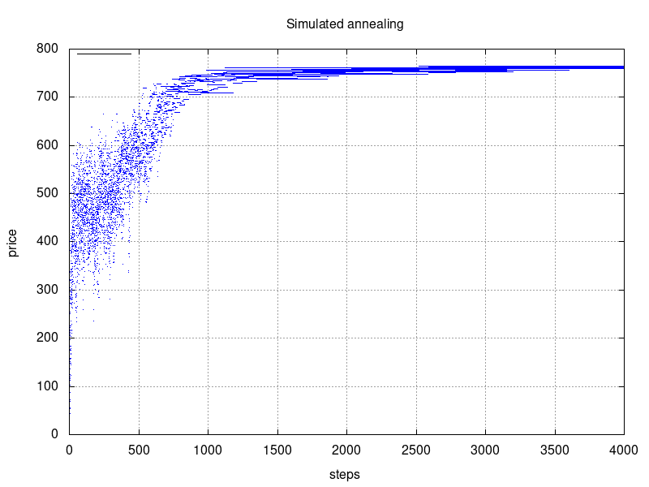
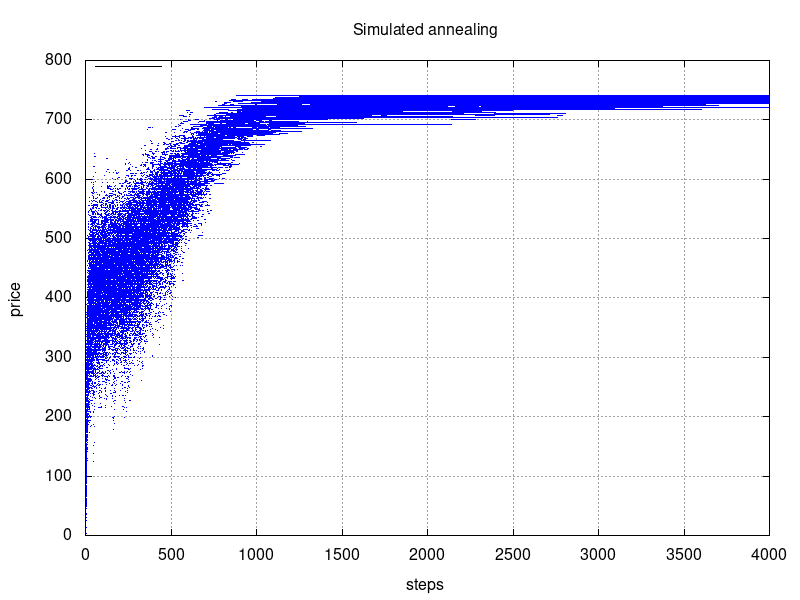
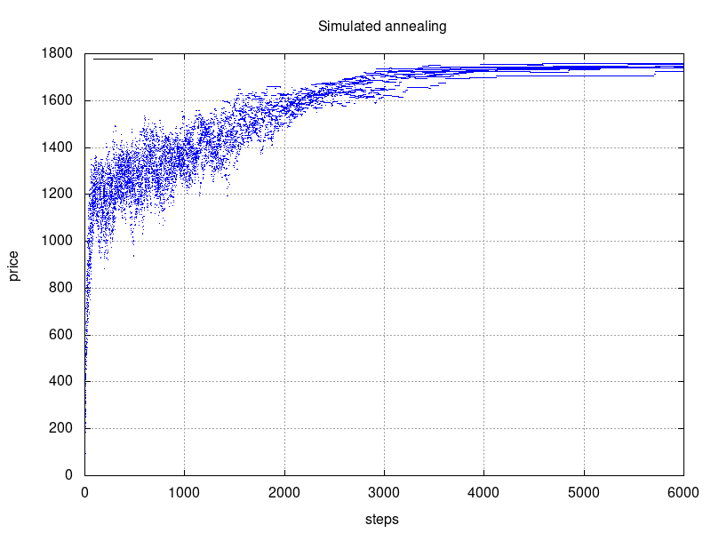
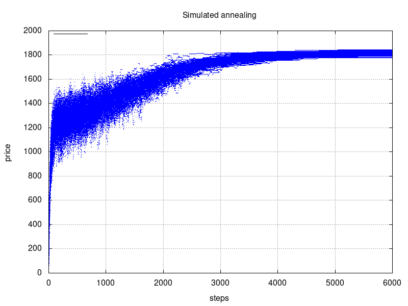

# MI-PAA - Knapsack problem
*Simon Let \<letsimon@fit.cvut.cz\>*

## Problem specification
The knapsack problem or rucksack problem is a problem in combinatorial optimization: Given a set of items, each with a weight and a value, determine the number of each item to include in a collection so that the total weight is less than or equal to a given limit and the total value is as large as possible.[1]  

Exact definition and instructions: https://edux.fit.cvut.cz/courses/MI-PAA/homeworks/04/start

## Possible solutions
- Bruteforce
- Heuristic solution
- Branch & bound
- Dynamic programming
- Fully polynomial time approximation scheme (FPTAS)
- Simulated annealing
- Genetic algorithm
- Tabu search

## Solution overview
In this report I will describe how I used **simulated annealing** to solve **knapsack problem**.

### Simulated annealing
Simulated annealing is a probabilistic technique for approximating the global optimum of a given function.[1]

“Annealing” refers to an analogy with thermodynamics, specifically with the way that metals cool and anneal. Simulated annealing uses the objective function of an optimization problem instead of the energy of a material.[2]

The algorithm is basically hill-climbing except instead of picking the best move, it picks a random move. If the selected move improves the solution, then it is always accepted. Otherwise, the algorithm makes the move anyway with some probability less than 1. The probability decreases exponentially with the “badness” of the move, which is the amount by which the solution is worsened (i.e., energy is increased.)[2]

## Algorithm description

### Simulated annealing

Algorithm consists of predefined number of individual steps.  
Each step consists of following:

1. Getting a new candidate solution by inverting N bits from current solution.

1. Checking if the new candidate solution total weight is not greater than capacity.

1. Using the new candidate solution if either the new solution is beter (greater total price) than the old one OR if random number between 0 and 1 is greater than `exp( (new_price - old_price) / temperature)`.

After certain amount of steps the temperature is lowered. (equilibrium => cooling) 
If no candidate solution is accepted for many steps the algorithm terminates. (frozen)

## Performance measurements 

I have used supplied problem instance generator.
I have used two different parametrizations for the instance generator.

### Random generator parameter values
- **Problem size: 40** 
- Max weight: 100
- Max Price: 40 
- Capacity to total price ratio: 0.65
- Granularity: 0

#### Simulated annealing parameter values
- Max steps: 4000
- Starting temperature: 200
- Frozen constant: 50 (algorithm terminates after **50** steps without new state) 
- Equilibrium constant: 50 (cooling is performed every **50** steps)
- Cooling koeficient: 0.95
- Neighbour constant: 10 (each neighbour has between 1 and *item_count* / **10** flipped bits)

**Average relative mistake: 0.5%**

title: 10 runs (better visibility of individual runs)

title: 100 runs (better statistical TODO)

### Random generator parameter values
- **Problem size: 100** 
- Max weight: 100
- Max Price: 40 
- Capacity to total price ratio: 0.65
- Granularity: 0

#### Simulated annealing parameter values
- Max steps: 6000
- Starting temperature: 60
- Frozen constant: 50 (algorithm terminates after **50** steps without new state) 
- Equilibrium constant: 50 (cooling is performed every **50** steps)
- Cooling koeficient: 0.99
- Neighbour constant: 20 (each neighbour has between 1 and *item_count* / **20** flipped bits)

**Average relative mistake: 2%**

title: 10 runs (better visibility of individual runs)

title: 100 runs (better statistical TODO)

*Relative mistake was calculated in reference to dynamic programming solution.*
*Measured using Intel Pentium G4560*

## Conclusion
In following section I will evaluate how each parameter affects the running time and relative mistake of chosen algorithms.

###  
Changing the *maximal weight* does not affect the running time of selected algorithms.

### Maximal price
Running time of **dynamic programming** solution (decomposition by price) is directly dependant on *maximal price*.   
In dynamic programming solution we need to solve table of all sub problems. The size of the table is equal to `number_of_items * total_price` which is directly dependant on *maximal price*.

### Capacity to total weight ratio 
#### CPU time
Random instance generation process:
1.  Instance is generated
1.  Capacity is calcualted based on:
    - *Capacity to total weight ratio* parameter
    - Total weight of generated instance

This means that we can assume that instances with different *capacity to total weight ratio* generally differ in capacity. 

**Dynamic programming** solution runs slower for instances with higer capacity.  
In my implementation of dynamic programming solution the algorithm stops when it's clear that every new solution would have weigth higher capacity.

**Branch and bound** dependance on *capacity to total weight ratio* is a bit more interesting. 
1. Running time raises with capacity. Branches are cut when their weight is greater than capacity. Higher capacity reduces the amount of cuts significantly.  
1. Running time is significantly lower for instances with capacities close to or higher than total price. Solutions for such instances contain (almost) all items. In my implementation of branch and bound the solutions containing (almost) all items are explored first and therefore found quickly.

#### Relative mistake
**Heuristic solution** has higher relative mistake for instances with low capacity to total weigth ratio.  
Lower ratio means that less items can fit into the bag which leads to higer chance of choosing sub-optimal item.

### Granularity
**Branch and bound** solution takes slightly more time for instances with more bigger items than for instances with more smaller items. The difference is noticable for granularity exponent higher than one.

## Source code
https://gitlab.fit.cvut.cz/letsimon/fit-ctu-mi-ppa/tree/v4.0/knapsack-problem

## References

[1]: https://en.wikipedia.org/wiki/Simulated_annealing
\[1\]: https://en.wikipedia.org/wiki/Simulated_annealing

[2]: http://www.cs.cmu.edu/afs/cs.cmu.edu/project/learn-43/lib/photoz/.g/web/glossary/anneal.html
\[2\]: http://www.cs.cmu.edu/afs/cs.cmu.edu/project/learn-43/lib/photoz/.g/web/glossary/anneal.html

