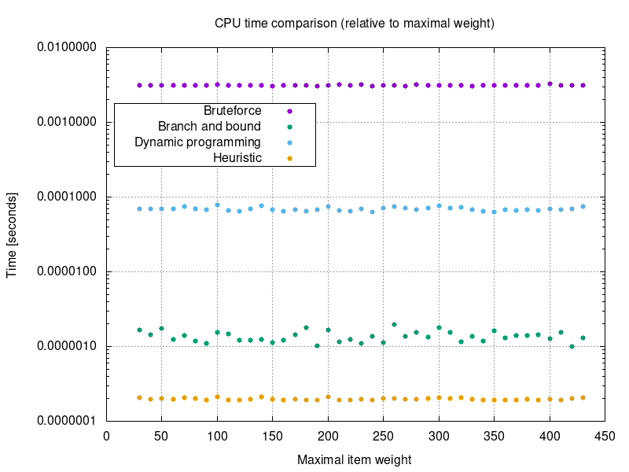
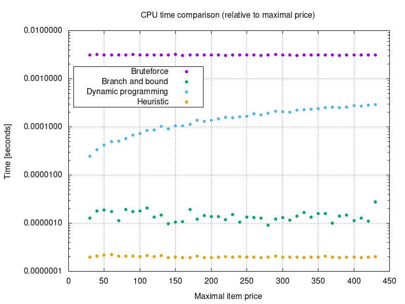
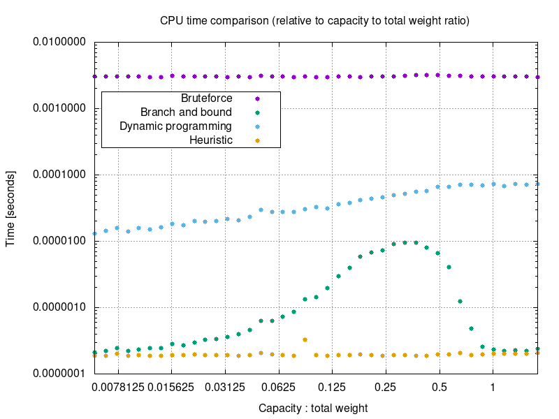
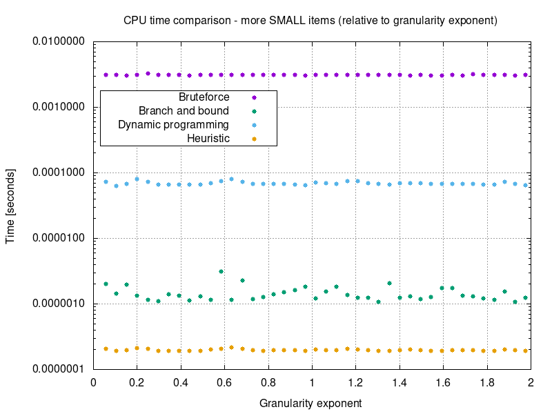
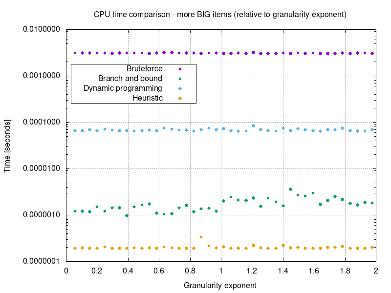
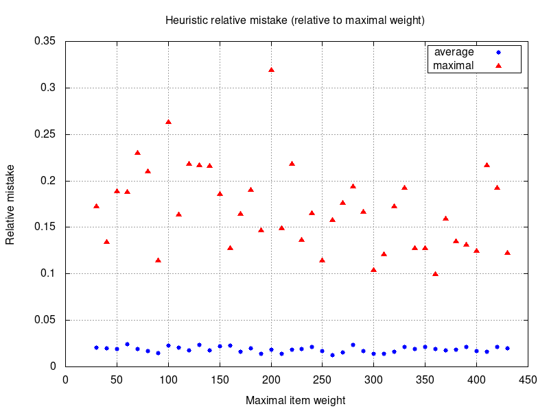
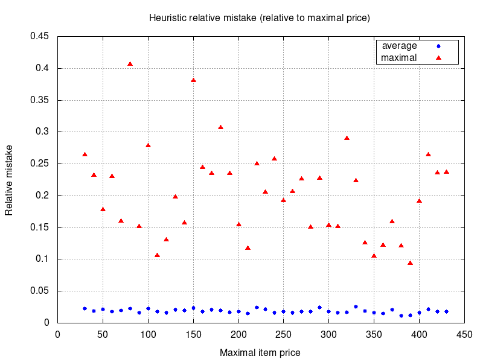
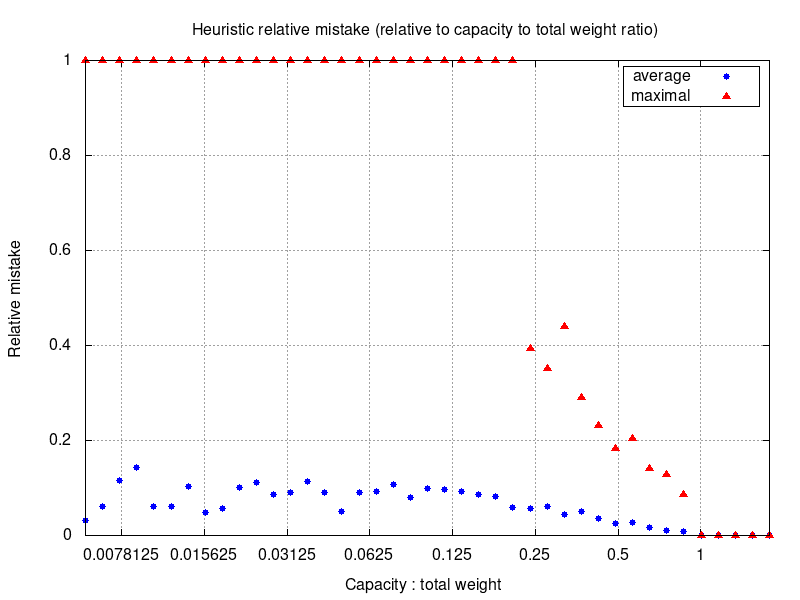
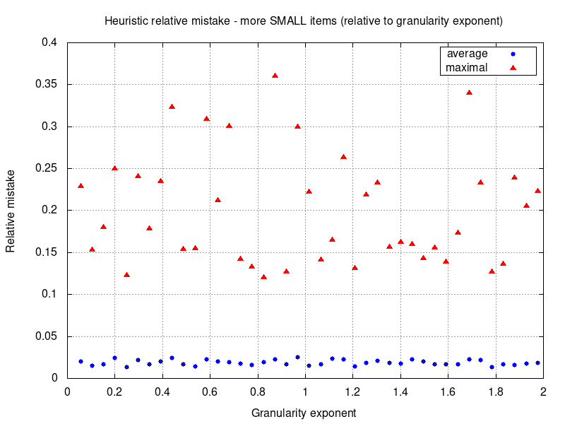
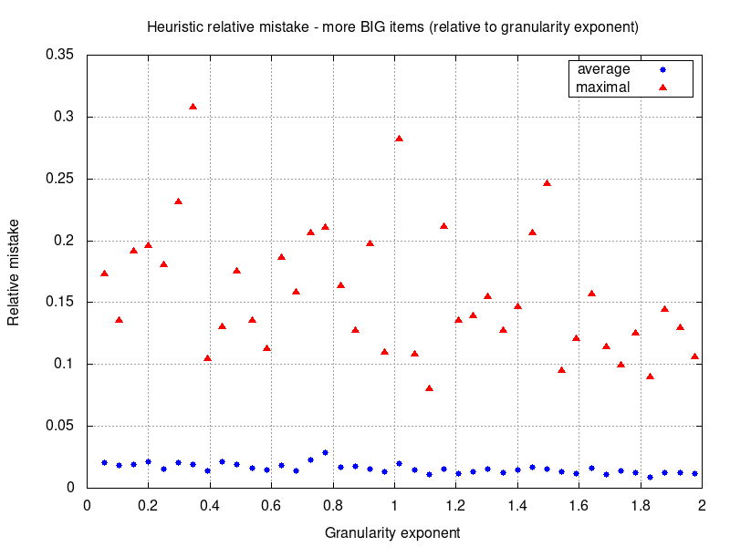

# MI-PAA - Knapsack problem
*Simon Let \<letsimon@fit.cvut.cz\>*

## Problem specification
The knapsack problem or rucksack problem is a problem in combinatorial optimization: Given a set of items, each with a weight and a value, determine the number of each item to include in a collection so that the total weight is less than or equal to a given limit and the total value is as large as possible.[1]  

Exact definition and instructions: https://edux.fit.cvut.cz/courses/MI-PAA/homeworks/01/start

## Possible solutions
- Bruteforce
- Heuristic solution
- Branch & bound
- Dynamic programming
- Fully polynomial time approximation scheme (FPTAS)

## Solution overview
In this report I will compare **bruteforce** solution, **heuristic** solution that uses price per weight as heuristic criteria, **branch & bound** solution and **dynamic programming** solution (decomposition by price).

### Bruteforce
Brute-force search, is a very general problem-solving technique that consists of systematically enumerating all possible candidates for the solution and checking whether each candidate satisfies the problem's statement.[2]

### Heuristic 
Heuristic approach, is any approach to problem solving, learning, or discovery that employs a practical method not guaranteed to be optimal or perfect, but sufficient for the immediate goals. Where finding an optimal solution is impossible or impractical, heuristic methods can be used to speed up the process of finding a satisfactory solution.[3]

I'm using **price per weight** as criteria for heuristic method.

### Branch & bound
A branch-and-bound algorithm explores a rooted tree that represents the state space of all possible solutions.

Before enumerating the candidate solutions of a branch, the branch is checked against upper and lower estimated bounds on the optimal solution, and is discarded if it cannot produce a better solution than the best one found so far by the algorithm.[5]

### Dynamic programming 
Dynamic programming is a method for solving a complex problem by breaking it down into a collection of simpler sub problems, solving each of those sub problems just once, and storing their solutions.  
A dynamic programming algorithm will examine the previously solved sub problems and will combine their solutions to give the best solution for the given problem.[6]

I'm **decomposing** the knapsack problem into a sub problems **by price**.

## Algorithm description

### Bruteforce
Imagine the state space of all possible solutions as a graph where nodes are solutions and there is an edge between solutions that only differ in one bit (one item is missing or one extra item is present).  
I'm using Hamiltonian path[4] to iterate trough all solutions in such a way that only one item is either added or removed from knapsack in each step.  
I'm incrementing a counter in each step and I'm using bit-wise representation of this counter to calculate next item to add or remove.  

### Branch & bound
Imagine the state space of all possible solutions as a binary tree where each leaf represents one solution and each inner node represents a set of solutions. 

First I sort the items by their price.  
Then I precompute the maximal price gain that can be achieved in each level of the tree (state space).   
I use **recursion** to explore the state space.   
I prune the branches that cannot contain optimal solution - one of following is true:
- Current weight is greater than knapsack capacity.
- Current price plus maximal price gain is less than price of already discovered solution.

### Price-per-weight heuristic 
First I sort the items by their price per weight.    
In each step I add item with the highest price:weight ratio. 
I stop when the next item can't be added because of insufficient capacity.

### Dynamic programming (decomposition by price) 
First I sort the items by their price.  
Then I create a table where each cell represents an optimal solution to a sub problem.  
Each cell contains a weight of the optimal solution for given sub problem (or INF if solution does not exist).  
`Xth` row represents solutions with price equal to `X`.  
`Xth` column represents solutions that only considers first `X` items from original problem.  
To get optimal solution for each cell we use solutions to sub problems from previous column.  
Optimal solution for each cell either **adds item corresponding to the column** or **uses previous solution with the same price** whichever gives lesser total weight.   
Final solution is the one with highest price with weight lower than capacity.

## Performance measurements 

### Default parameter values
- Problem size: 5 - 25
- Max weight: 100
- Max Price: 100
- Capacity to total price ratio: 0.65
- Granularity: 0

*Measured using Intel Pentium G4560*

 
 
 
 
 
 
 
 

## Conclusion
In following section I will evaluate how each parameter affects the running time and relative mistake of chosen algorithms.

### Maximal weight
Changing the *maximal weight* does not affect the running time of selected algorithms.

### Maximal price
Running time of **dynamic programming** solution (decomposition by price) is directly dependant on *maximal price*.   
In dynamic programming solution we need to solve table of all sub problems. The size of the table is equal to `number_of_items * total_price` which is directly dependant on *maximal price*.

### Capacity to total weight ratio 
#### CPU time
Random instance generation process:
1.  Instance is generated
1.  Capacity is calcualted based on:
    - *Capacity to total weight ratio* parameter
    - Total weight of generated instance

This means that we can assume that instances with different *capacity to total weight ratio* generally differ in capacity. 

**Dynamic programming** solution runs slower for instances with higer capacity.  
In my implementation of dynamic programming solution the algorithm stops when it's clear that every new solution would have weigth higher capacity.

**Branch and bound** dependance on *capacity to total weight ratio* is a bit more interesting. 
1. Running time raises with capacity. Branches are cut when their weight is greater than capacity. Higher capacity reduces the amount of cuts significantly.  
1. Running time is significantly lower for instances with capacities close to or higher than total price. Solutions for such instances contain (almost) all items. In my implementation of branch and bound the solutions containing (almost) all items are explored first and therefore found quickly.

#### Relative mistake
**Heuristic solution** has higher relative mistake for instances with low capacity to total weigth ratio.  
Lower ratio means that less items can fit into the bag which leads to higer chance of choosing sub-optimal item.

### Granularity
**Branch and bound** solution takes slightly more time for instances with more bigger items than for instances with more smaller items. The difference is noticable for granularity exponent higher than one.

## Source code
https://gitlab.fit.cvut.cz/letsimon/fit-ctu-mi-ppa/tree/3.0/knapsack-problem

## References

[1]: https://en.wikipedia.org/wiki/Knapsack_problem  
\[1\]: https://en.wikipedia.org/wiki/Knapsack_problem

[2]: https://en.wikipedia.org/wiki/Brute-force_search
\[2\]: https://en.wikipedia.org/wiki/Brute-force_search

[3]: https://en.wikipedia.org/wiki/Heuristic
\[3\]: https://en.wikipedia.org/wiki/Heuristic

[4]: https://en.wikipedia.org/wiki/Hamiltonian_path
\[4\]: https://en.wikipedia.org/wiki/Hamiltonian_path

[5]: https://en.wikipedia.org/wiki/Branch_and_bound
\[5\]: https://en.wikipedia.org/wiki/Branch_and_bound

[6]: https://en.wikipedia.org/wiki/Dynamic_programming
\[6\]: https://en.wikipedia.org/wiki/Dynamic_programming

