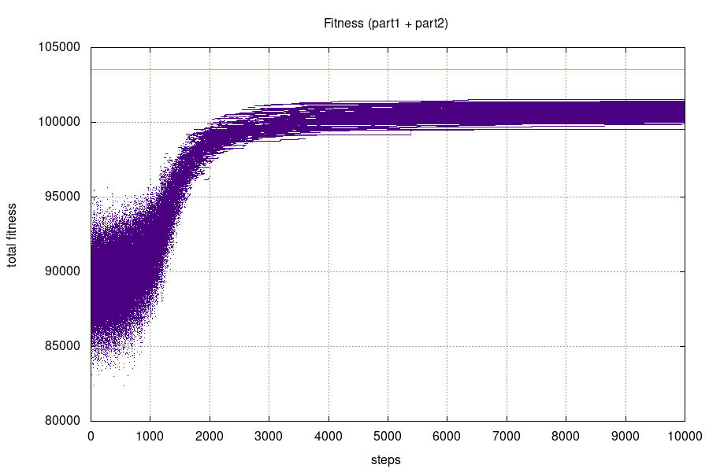
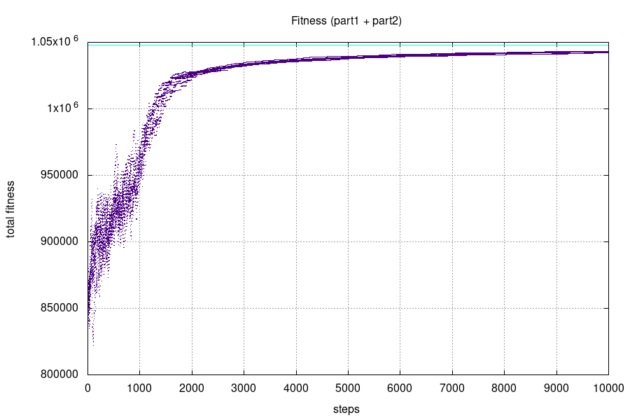
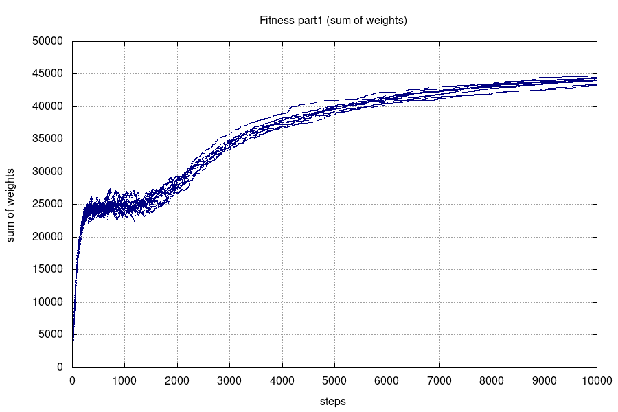
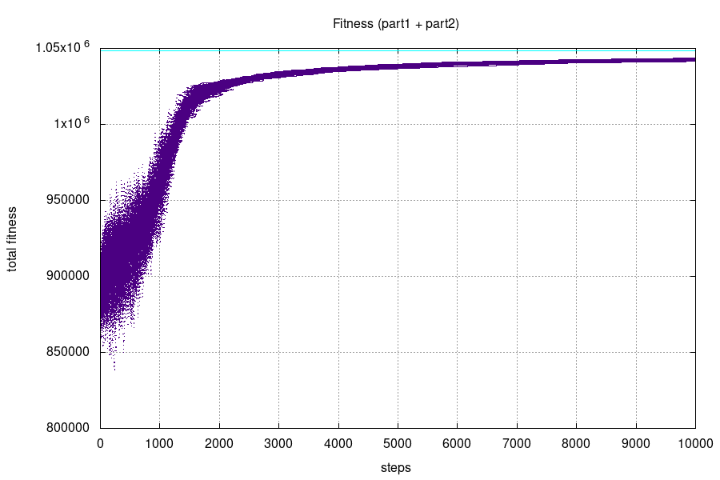
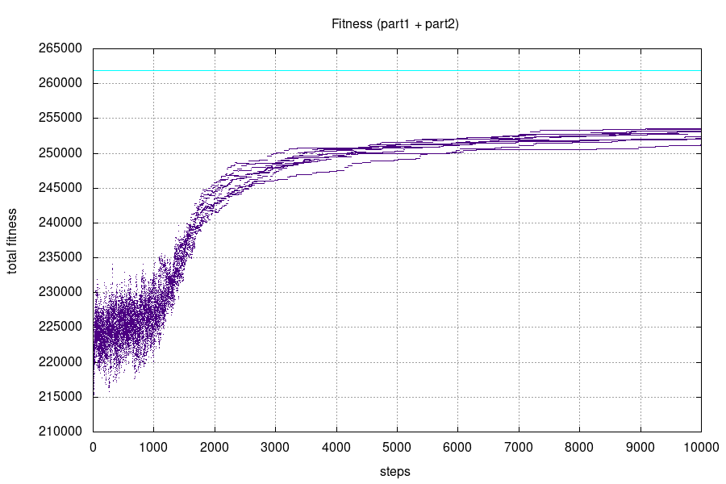
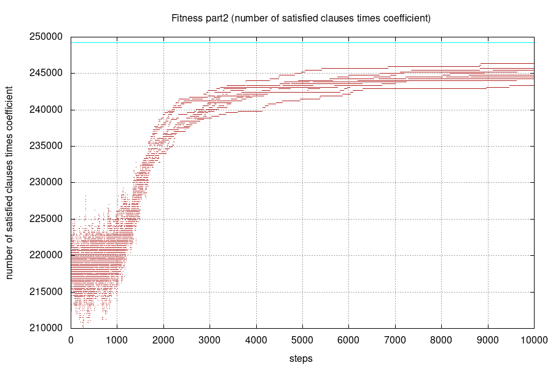
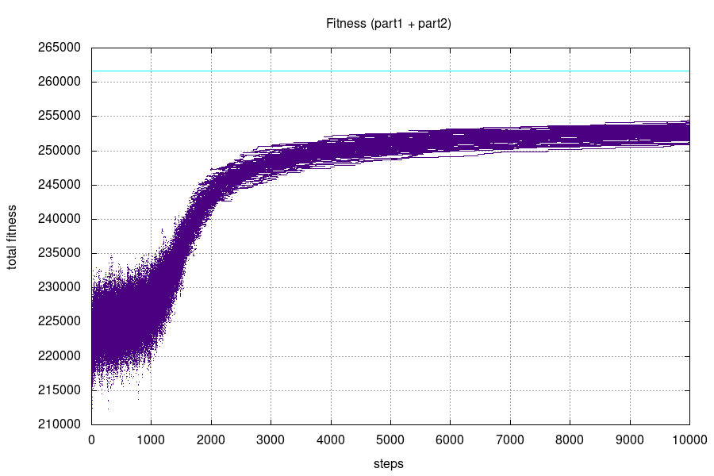

# MI-PAA - Boolean satisfiability problem
*Simon Let \<letsimon@fit.cvut.cz\>*

## Problem specification
The boolean satisfiability problem is the problem of determining if there exists an interpretation that satisfies a given Boolean formula.[3]  
SAT is the first problem that was proven to be NP-complete.[3]  

SAT with weighted variables is variant of the problem where each variable has a given weight and the goal is to maximize sum of weights of variables that are true.

Exact definition and instructions: https://edux.fit.cvut.cz/courses/MI-PAA/homeworks/05/start

## Possible solutions

- Bruteforce
- Simulated annealing
- Genetic algorithm
- Tabu search

## Solution overview
In this report, I will describe how I used **simulated annealing** to solve the **SAT problem**.
I will use 3-SAT version of the problem. 

This simplified version of the SAT problem is also NP-complete[4].

### Simulated annealing
Simulated annealing is a probabilistic technique for approximating the global optimum of a given function.[1]

“Annealing” refers to an analogy with thermodynamics, specifically with the way that metals cool and anneal. Simulated annealing uses the objective function of an optimization problem instead of the energy of a material.[2]

The algorithm is basically hill-climbing except instead of picking the best move, it picks a random move. If the selected move improves the solution, then it is always accepted. Otherwise, the algorithm makes the move anyway with some probability less than 1. The probability decreases exponentially with the “badness” of the move, which is the amount by which the solution is worsened (i.e., energy is increased.)[2] This probability decreases with time.

The algorithm is likely to accept "bad" solutions at first. But with time the algorithm is less and less likely to accept "bad" solutions. In the end, the algorithm accepts almost only better solutions.

## Algorithm description

The simulated annealing algorithm consists of a predefined number of individual steps.  
Each step consists of following:

1. Getting a new candidate solution by inverting N bits from current solution.

1. Using the new candidate solution if either the new solution is better (greater fitness) than the old one OR if a random number between 0 and 1 is greater than `exp( (new_fitness - old_fitness) / temperature)`.

After a certain amount of steps, the temperature is lowered. (equilibrium => cooling)   
If no candidate solution is accepted for many steps the algorithm terminates. (frozen)

### Non-satisfying solutions and the Fitness measure

I have included non-satisfying solutions in the state-space because it makes the state-space more connected and much more likely to be continuous.

The goal of the algorithm is to find only satisfying solutions because of that I need to make algorithm favour the satisfying solutions over non-satisfying ones.
To achieve this I have included penalisation for non-satisfying solutions into my fitness function.

The fitness measure is a total of two parts:
1. Sum of weights of variables with value `1`. (Actual/main fitness measure)
1. Number of satisfied clauses multiplied by given `fitness_coeficient`. (Penalisation for non-satisfying solutions)

`fitness_coeficient` has to be great enough to eventualy eliminate all non-satisfying solutions. 
But it can't be so great that all non-satisfying solutions are omitted immediately.

### Algorithm parameters

- `max_steps`: Maximal number of steps the algorithm will perform.

- `starting_temperature`: Temperature is initalized to this value.

- `frozen_constant`: Algorithm ends if no new state was accepted for `frozen_constant` of steps.

- `cooling_coeficient` and `equlibrium_constant`: Temperature is multiplied by `cooling_coeficient` (number < 1) every `equlibrium_constant` steps.

- `neighbour_constant`: Neighbour is constructed by flipping `total_bit_count / neighbour_constant` bits.

- `fitness_coeficient`: Ceoficient used to balance the penalisation applied to non-satisfying solutions. (See paragraph above)

## 3-SAT problem instance generator

I have written my own 3-SAT problem instance generator.

Generator generates 3-SAT problem instance given desired *number of variables* and desired *number of clauses*.

Weights are randomly generated in range from `0` to `100`.

Clauses are generated iteratively. A variable is randomly picked three times and added to clause. Each picked variable has `0.5` chance to be negated.  
Same variables can repeat within a single clause. 

## Parameter estimation and tunning

Simulated annealing consists of two main parts.
It is curcial to understand these phases and their purpose to esimate and tune the parameters effectively.

### Diversification 

Simulated annealing algorithm starts in diversification phase.  
The goal of diversification phase is to explore huge portion of the state-space.  
During diversification phase the temperature is high, because of that agorithm does not get stuck in local maxima and accepts worse solutions quite frequently.  

If the diversification phase is ended prematurely it is likely that algorithm gets stuck in local maxima and there is much better solution somewhere far away in the state-space.

### Intensification 

Due to continuously lowering temperature the algorithm enters intensification phase.  
The goal of intensification phase is to intensively explore smaller portion of the state-space and find the local maxima.  
Because of low temperature the algorihm is unlikely to accept worse solutions and explores many of it's imidiate neighbours.  

If the intensification phase is ended prematurely it is likely that algorithm did not find the local maxima and there is a better solution somewhere close in the state-space.

## Performance measurements 

I have used many different parametrizations for the instance generator.

**Generator parameter values**
- Variable count: 5 - 5000
- Clause count: 10 - 10000

I have found parameter settings that gives consistent results for all generated instances. 

**Simulated annealing parameter values**
Parameter values depend on variable count (`var_cnt`) and clausule count (`cl_cnt`). 
- Max steps: 10000
- Starting temperature: `(var_cnt * cl_cnt / 10) + 20000`
- Frozen constant: `0.4 * var_cnt + 100` 
- Equilibrium constant: `10`
- Cooling koeficient: `0.965`
- Neighbour constant: `log(var_cnt)^1.3`
- Fitness koeficient: `1000 * var_cnt / cl_cnt` 

I have measured average mistake relative to **theoretical best possible solution**.
I calculated it as a sum of all weights and number of clauses multiplied by coeficient.
Each plot includes a cyan line that represents theoretical best possible value. 

### Setting #1

- Varible count: 99  
- Clause count: 99  

- **Average relative mistake: 0.1%**  
- Average CPU time: 0.01 s

#### Plots of 10 runs  

#### Plot of 100 runs (more statisticaly significant)

### Setting #2

- Varible count: 99  
- Clause count: 399  

- **Average relative mistake: 0.9%**  
- Average CPU time: 0.015 s

#### Plots of 10 runs  

#### Plot of 100 runs (more statisticaly significant)

### Setting #3

- Varible count: 999  
- Clause count: 399  

- **Average relative mistake: 0.02%**  
- Average CPU time: 0.032 s

#### Plots of 10 runs  

#### Plot of 100 runs (more statisticaly significant)

### Setting #4

- Varible count: 21 
- Clause count: 91

- **Average relative mistake: 0.5%**  
- Average CPU time: 0.027 s

#### Plots of 10 runs  

#### Plot of 100 runs (more statisticaly significant)

### Setting #5

- Varible count: 250 
- Clause count: 1065 

- **Average relative mistake: 1.7%**  
- Average CPU time: 0.082 s

#### Plots of 10 runs  

#### Plot of 100 runs (more statisticaly significant)

*Relative mistake was calculated in reference to dynamic programming solution.*  
*Measured using Intel Pentium G4560*

## Conclusion
In the following section, I will describe the parameter tunning process. I will evaluate the results and I will pinpoint some observations I have made.

### Parameter tunning process

I have generated 10 instances of the problem.  
Then for each instance, I have run the algorithm 100 times to reach at least *some* level of statistical significance.  
Using obtained data I have created 10 plots (one for each instance).  

After that, I have adjusted the algorithm parameters and repeated the process.

### Measurements evaluation

I have tuned the algorithm parameters to minimize the relative mistake of the algorithm.  
The plots of price development contain both intensification and diversification.

### Neighbour creation

At first, I have created neighbour solutions by flipping only one bit. Neighbouring solutions had a very big difference in price (one added or removed item). Because of that, there were many local maxima and the algorithm was more likely to get stuck in one. This has led to marginally worse solutions (about 10 times worse). 

I have changed the neighbour creation to flipping N bits. This meant that neighbour could have some items added and some removed which have led to a smaller difference in price. Another thing worth mentioning is that this way each solution has more neighbours. Which should help to reduce the likelihood of getting stuck in a suboptimal state.

## Source code
https://gitlab.fit.cvut.cz/letsimon/fit-ctu-mi-ppa/tree/v4.0/knapsack-problem

## References

[1]: https://en.wikipedia.org/wiki/Simulated_annealing
\[1\]: https://en.wikipedia.org/wiki/Simulated_annealing

[2]: http://www.cs.cmu.edu/afs/cs.cmu.edu/project/learn-43/lib/photoz/.g/web/glossary/anneal.html
\[2\]: http://www.cs.cmu.edu/afs/cs.cmu.edu/project/learn-43/lib/photoz/.g/web/glossary/anneal.html

[3]: https://en.wikipedia.org/wiki/Boolean_satisfiability_problem
\[3\]: https://en.wikipedia.org/wiki/Boolean_satisfiability_problem

[4]: https://edux.fit.cvut.cz/courses/MI-PAA/homeworks/05/start
\[4\]: https://edux.fit.cvut.cz/courses/MI-PAA/homeworks/05/start
