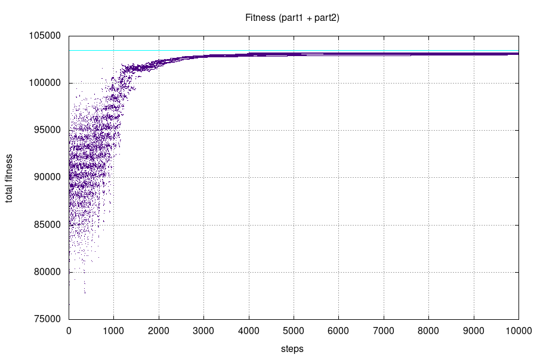
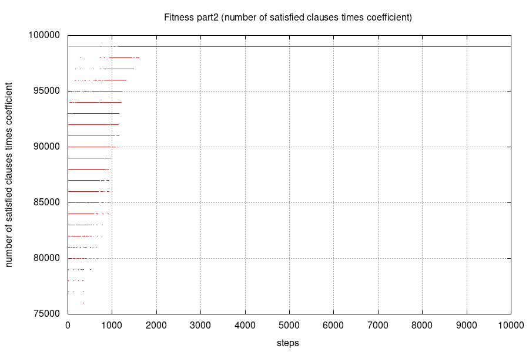
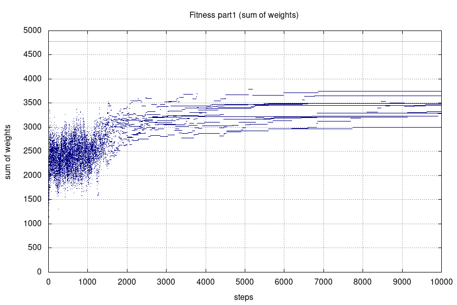

# MI-PAA - Boolean satisfiability problem
*Simon Let \<letsimon@fit.cvut.cz\>*

## Problem specification
The boolean satisfiability problem is the problem of determining if there exists an interpretation that satisfies a given Boolean formula.[1]  
SAT is the first problem that was proven to be NP-complete.[1]  

SAT with weighted variables is variant of the problem where each variable has a given weight and the goal is to maximize the sum of weights of variables that are true.

Exact definition and instructions: https://edux.fit.cvut.cz/courses/MI-PAA/homeworks/05/start

## Possible solutions

- Bruteforce
- Simulated annealing
- Genetic algorithm
- Tabu search

## Solution overview
In this report, I will describe how I used **simulated annealing** to solve the **SAT problem**.
I will use a 3-SAT version of the problem. 

This simplified version of the SAT problem is also NP-complete.[2]

### Simulated annealing
Simulated annealing is a probabilistic technique for approximating the global optimum of a given function.[3]

“Annealing” refers to an analogy with thermodynamics, specifically with the way that metals cool and anneal. Simulated annealing uses the objective function of an optimization problem instead of the energy of a material.[4]

The algorithm is basically hill-climbing except instead of picking the best move, it picks a random move. If the selected move improves the solution, then it is always accepted. Otherwise, the algorithm makes the move anyway with some probability less than 1. The probability decreases exponentially with the “badness” of the move, which is the amount by which the solution is worsened (i.e., energy is increased.)[4] This probability decreases with time.

The algorithm is likely to accept "bad" solutions at first. But with time the algorithm is less and less likely to accept "bad" solutions. In the end, the algorithm accepts almost only better solutions.

## Algorithm description

The simulated annealing algorithm consists of a predefined number of individual steps.  
Each step consists of following:

1. Getting a new candidate solution by inverting N bits from current solution.

1. Using the new candidate solution if either the new solution is better (greater fitness) than the old one OR if a random number between 0 and 1 is greater than `exp( (new_fitness - old_fitness) / temperature)`.

 
 
 
 

After a certain amount of steps, the temperature is lowered. (equilibrium => cooling)   
If no candidate solution is accepted for many steps the algorithm terminates. (frozen)

### Unsatisfying solutions and the Fitness measure

I have included unsatisfying solutions in the state-space because it makes the state-space more connected and much more likely to be continuous.

The goal of the algorithm is to find only the satisfying solutions. Because of that, I need to make algorithm favour the satisfying solutions over the unsatisfying ones.
To achieve this I have included penalization for unsatisfying solutions into my fitness function.

The fitness measure is a total of two parts:
1. Sum of weights of variables with value `1`/`True`. (Main part of fitness measure)
1. A number of satisfied clauses multiplied by given `fitness_coeficient`. (Penalisation for unsatisfying solutions)

The `fitness_coeficient` has to be great enough to eventually eliminate all unsatisfying solutions. 
But it can't be so great that all unsatisfying solutions are omitted immediately.

### Algorithm parameters

- `max_steps`: Maximal number of steps the algorithm will perform.
- `starting_temperature`: Temperature is initialized to this value.
- `frozen_constant`: Algorithm ends if no new state was accepted for `frozen_constant` of steps.
- `cooling_coeficient` and `equlibrium_constant`: Temperature is multiplied by `cooling_coeficient` (number < 1) every `equlibrium_constant` steps.
- `neighbour_constant`: Neighbour is constructed by flipping from `1` to `neighbour_constant` bits.
- `fitness_coeficient`: Coefficient used to balance the penalization applied to unsatisfying solutions. (See paragraph above)

## 3-SAT problem instance generator

I have written my own 3-SAT problem instance generator.  
The generator generates 3-SAT problem instance given desired *number of variables* and desired *number of clauses*.  
Weights are randomly generated in the range from `0` to `100`.  

Clauses are generated iteratively. A variable is randomly picked three times and added to the clause. Each picked variable has `50%` chance to be negated.   
Same variables can repeat within a single clause. 

 
 
 
 
 
 
 
 
 
 
 
 
 
 
 
 
 
 
 
 

## Performance measurements 

I have used many different parametrizations for the instance generator.

**Generator parameter values**
- `variable_count`: `20 - 1000`
- `clause_count`: `14 - 4700`

I have found parameter setting that gives consistent results for all generated instances. 

**Simulated annealing parameter values**

Parameter values depend on variable count (`variable_count`) and clausule count (`clause_count`). 

- `max_steps`: `10000`
- `starting_temperature`: `(variable_count * clause_count / 10) + 20000`
- `frozen_constant`: `0.4 * variable_count + 100` 
- `equlibrium_constant`: `10`
- `cooling_coefficient`: `0.965`                   
- `neighbour_constant`: `log(variable_count)^1.3`        
- `fitness_coefficient`: `1000 * variable_count / clause_count` 

**Measurements**

I have used 5 different generator settings to show the algorithm run in more detail.
And I have also generated `10 000` random SAT problem instances and used them to get more statistically significant performance measurements.   
I have created plots for the `5` different generator settings.  

There are multiple plots for each generator setting to show the algorithm run in detail.  
There are also plots for individual parts that fitness measure consists of.  
These plots show the progress of both satisfiability solving and weight maximization.  

I have measured average mistake relative to a **theoretical best possible solution**.
I calculated it as a sum of all weights and number of clauses multiplied by the coefficient.
Each plot includes a cyan line that represents the theoretically best possible value. 

 
 
 
 
 
 
 
 
 
 
 
 
 
 
 
 
 
 
 
 
 
 
 
 

### Setting #1

- `variable_count`: `99`  
- `clause_count`: `99`  

- **Average relative mistake: 0.1 %**  
- Average CPU time: 0.01 s

#### Plots of 10 runs  

#### Plot of 100 runs (more statisticaly significant)

 
 
 
 
 
 

### Setting #2

- `variable_count`: `99` 
- `clause_count`: `399`

- **Average relative mistake: 0.9 %**  
- Average CPU time: 0.015 s

#### Plots of 10 runs  

#### Plot of 100 runs (more statisticaly significant)

 
 
 
 
 
 

### Setting #3

- `variable_count`: `999`
- `clause_count`: `399`

- **Average relative mistake: 0.02 %**  
- Average CPU time: 0.032 s

#### Plots of 10 runs  

#### Plot of 100 runs (more statisticaly significant)

 
 
 
 
 
 

### Setting #4

- `variable_count`: `21`
- `clause_count`: `91`

- **Average relative mistake: 0.5 %**  
- Average CPU time: 0.027 s

#### Plots of 10 runs  

#### Plot of 100 runs (more statisticaly significant)

 
 
 
 
 
 

### Setting #5

- `variable_count`: `250`
- `clause_count`: `1065` 

- **Average relative mistake: 1.7 %**  
- Average CPU time: 0.082 s

#### Plots of 10 runs  

#### Plot of 100 runs (more statisticaly significant)

 
 
 
 
 
 
 
 

### Randomized settings

I have generated `10 000` random instances using following parameters:

- `variable_count`: random number from interval `20 - 1000`
- `clause_count`: random real number from interval `0.7 - 4.7` times `variable_count`

- **Average relative mistake: 1 %**  
- Average CPU time: 0.088 s

*Relative mistake was calculated in reference to dynamic programming solution.*  
*Measured using Intel Pentium G4560*

## Conclusion

In the following section, I will describe the parameter tuning process and I will evaluate the results.  
But just before that I am going to briefly explain the phases of simulated annealing.

### Phases of simulated annealing 

Simulated annealing consists of two main phases.
It is crucial to understand these phases and their purpose in order to estimate and tune the parameters effectively.

#### Diversification 

Simulated annealing algorithm starts in the diversification phase.  
The goal of the diversification phase is to explore a huge portion of the state-space.  
During diversification phase the temperature is high, because of that the algorithm does not get stuck in local maxima and accepts worse solutions quite frequently.  

If the diversification phase is ended prematurely it is likely that the algorithm gets stuck in local maxima and there is a much better solution somewhere far away in the state-space.

#### Intensification 

Due to continuously lowering temperature the algorithm enters the intensification phase.  
The goal of the intensification phase is to intensively explore a smaller portion of the state-space and find the local maxima.  
Because of low temperature, the algorithm is unlikely to accept worse solutions and explores many of its immediate neighbors.  

If the intensification phase is ended prematurely it is likely that algorithm did not find the local maxima and there is a better solution somewhere close in the state-space.

### Parameter tunning process

1. I have started by finding one parameter configuration that worked for one setting of the random generator.  
1. Then I modified this parameter configuration to work for several other generator settings.  
1. Next step was finding an arbitrary functions dependant on generator parametrization that would give me desired values for algorithm parameters. 
1. Finally, I thoroughly tested the parameter functions on many generator settings.   

I will describe these steps in a little more detail in following sections.

 
 
 
 
 
 
 
 
 

#### Starting parameters

I have chosen all the parameter values in a way that would result in a longer algorithm run that would give somewhat reasonable results. 

- `max_steps`: I have used a really high number (`100 000`) because small `max_steps` could terminate the algorithm prematurely. I planned to lower the `max_steps` later to speed up the algorithm.
- `starting_temperature`: I have started with a rather high number (`10 000`) because I wanted to ensure that the diversification phase will occur.   
- `frozen_constant`: I have also set this to a really large value so it does not terminate algorithm too early.
- `cooling_coeficient`: I have started with a number almost equal to `1` to encourage long diversification phase.
- `equlibrium_constant`: I have used a value (`10`) that I never had to change. I was thinking that I would later implement more advanced equilibrium. That never happened because I got sufficient results using just the simple version. 
- `neighbour_constant`: I have used a small value (`10`) because I started with smaller instances and I did not want the algorithm to generate neighbors that are too random. 
- `fitness_coeficient`: I needed the algorithm to focus on solving SAT and to not just optimize for maximum variable weight so I chose a rather high value (`1000`).

#### Paramter tunning 

I have tuned the algorithm parameters to minimize the relative mistake of the algorithm.   
I observed the plots after each parameter change to ensure that algorithm runs contain both the intensification and the diversification phase.  

The simplified ordered list of major changes and parameter tunning I have made:
1. Balancing the `starting_temperature` and the `cooling_coeficient` to achieve a balance between the diversification and the intensification phase. 
2. Lowering the `fitness_coeficient` to create more pressure on optimizing for the maximal sum of weights of variables. I lowered the value until algorithm started giving unsatisfying solutions to satisfiable instances.
3. Trying multiple values for `neighbour_constant` and empirically finding the value that gives minimal relative mistake.
4. Lowering the `max_steps` and the `frozen_constant` to speed up the algorithm without making relative mistake significantly larger.

I have made more changes in between the steps that were either minor or did not yield significant results.  
The most significant steps of parameter tuning are listed above.

#### Finding univarsal parameters

After finding algorithm parameter configuration for multiple generator settings I wanted to create a universal configuration.  
In order for the algorithm to work on various generated instances, I needed to use the generator settings to calculate algorithm parameters.  

Fortunately, the algorithm is not *extremely* sensitive to its parameters.

Because of that, I have managed to find functions dependant on generator settings that yield working algorithm parameters.

The algorithm is more sensitive to some parameters than the others namely the `neighbour_constant` and the `fitness_coeficient` therefore the function for these parameters are more precise.

### Results evaluation

Plots show both the diversification and the intensification phase of the algorithm.
Results show that the relative mistake and running times are reasonable.
The relative mistake is low despite being referenced to a hypothetical best solution that might not often exist.

Plots show that the algorithm often does not find a satisfying solution for harder instances.
Which is understandable because the generator is likely to generate unsatisfiable SAT problems.

The measurements prove that the algorithm and the parametrization work reasonably for a rather large class of instances.

 
 

## Source code
https://gitlab.fit.cvut.cz/letsimon/fit-ctu-mi-ppa/tree/v5.0/sat-problem

## References

[1]: https://en.wikipedia.org/wiki/Boolean_satisfiability_problem
\[1\]: https://en.wikipedia.org/wiki/Boolean_satisfiability_problem

[2]: https://edux.fit.cvut.cz/courses/MI-PAA/homeworks/05/start
\[2\]: https://edux.fit.cvut.cz/courses/MI-PAA/homeworks/05/start

[3]: https://en.wikipedia.org/wiki/Simulated_annealing
\[3\]: https://en.wikipedia.org/wiki/Simulated_annealing

[4]: http://www.cs.cmu.edu/afs/cs.cmu.edu/project/learn-43/lib/photoz/.g/web/glossary/anneal.html
\[4\]: http://www.cs.cmu.edu/afs/cs.cmu.edu/project/learn-43/lib/photoz/.g/web/glossary/anneal.html
